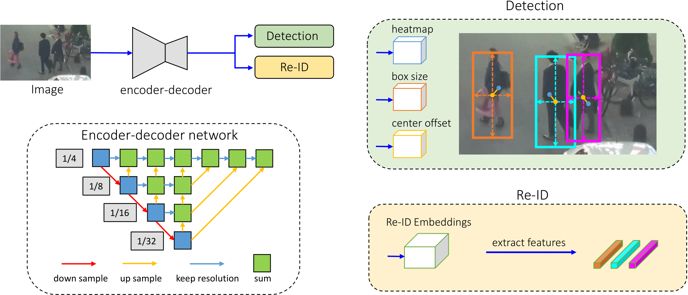

# ITRI_AICamera
## Abstract
This project's theme is Smart camera movement by Artificial intelligence. And it's from Taiwan Industrial Technology Research Institute (ITRI) - Information and Communication Research Institute (ICL) 5g+ system and application quenching project. Our Target ....

# FairMOT
A simple baseline for one-shot multi-object tracking:

> [**A Simple Baseline for Multi-Object Tracking**](http://arxiv.org/abs/2004.01888),            
> Yifu Zhang, Chunyu Wang, Xinggang Wang, Wenjun Zeng, Wenyu Liu,        
> *arXiv technical report ([arXiv 2004.01888](http://arxiv.org/abs/2004.01888))*
